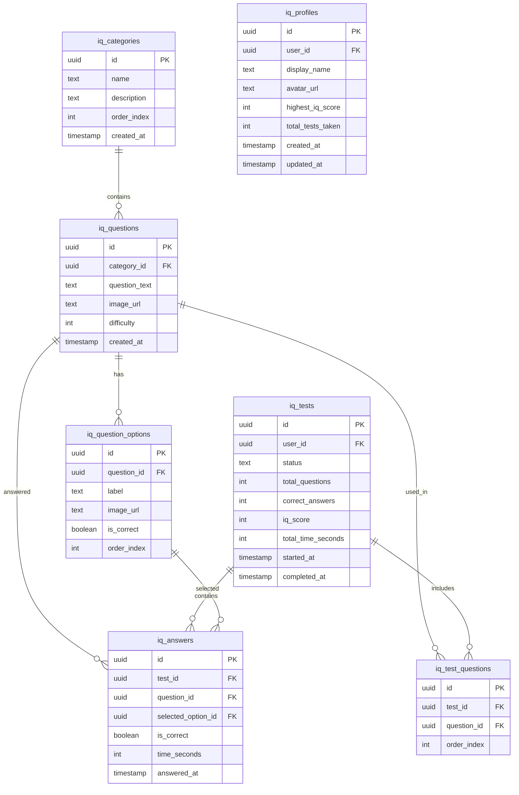

# 汎用Supabaseプロジェクト運用ガイド

## 概要

「all-app-project」は複数のアプリケーションで共有するSupabaseプロジェクトです。
各アプリケーションはテーブル名にプレフィックスを付けることで、1つのデータベース内で独立して運用できます。

## プロジェクト情報

| 項目               | 値                                  |
| ------------------ | ----------------------------------- |
| プロジェクト名     | all-app-project                     |
| プロジェクトID     | wuxhiuoxnwsqpcmjowse                |
| リージョン         | ap-northeast-1（東京）              |
| データベースホスト | db.wuxhiuoxnwsqpcmjowse.supabase.co |
| 作成日             | 2025-12-02                          |

## 命名規則

### テーブル名

各アプリケーションは以下の形式でテーブル名を付けます：

```
{app_prefix}_{table_name}
```

### 登録済みプレフィックス

| プレフィックス | アプリケーション名 | 説明         |
| -------------- | ------------------ | ------------ |
| `iq_`        | IQ Evaluation App  | IQ測定アプリ |

### プレフィックス追加手順

1. このドキュメントの「登録済みプレフィックス」テーブルに新しいエントリを追加
2. 重複がないことを確認
3. テーブル作成時は必ずプレフィックスを使用

## IQ Evaluation App のテーブル構成

### テーブル一覧

| テーブル名              | 説明                   |
| ----------------------- | ---------------------- |
| `iq_categories`       | 問題カテゴリ（10単元） |
| `iq_questions`        | 問題データ             |
| `iq_question_options` | 選択肢データ           |
| `iq_profiles`         | ユーザープロフィール   |
| `iq_tests`            | テスト実施記録         |
| `iq_test_questions`   | テストごとの出題問題   |
| `iq_answers`          | ユーザーの回答記録     |

### ER図



## RLSポリシー設計

### 基本方針

- 各テーブルでRow Level Securityを有効化
- ユーザーは自分のデータのみアクセス可能
- ゲストユーザー（UUID: 00000000-0000-0000-0000-000000000000）もサポート
- カテゴリ・問題データは全ユーザーが読み取り可能

### ポリシー詳細

#### iq_categories / iq_questions / iq_question_options

- SELECT: 全ユーザー許可（認証不要）
- INSERT/UPDATE/DELETE: サービスロールのみ

#### iq_profiles

- SELECT: 自分のプロフィールのみ
- INSERT: 認証済みユーザー（自分のプロフィール作成）
- UPDATE: 自分のプロフィールのみ

#### iq_tests / iq_answers

- SELECT: 自分のテスト・回答のみ
- INSERT: 認証済みユーザー（自分のテスト・回答作成）
- UPDATE: 自分のテストのみ（ステータス更新など）

## ストレージバケット

| バケット名             | 用途                 |
| ---------------------- | -------------------- |
| `iq-question-images` | 問題画像・選択肢画像 |

### ストレージ構造

```
iq-question-images/
├── questions/
│   └── {category_id}/
│       └── {question_id}.png
└── options/
    └── {question_id}/
        └── {option_label}.png
```

## 新規アプリケーション追加手順

1. **プレフィックスの決定**

   - 短く、わかりやすいプレフィックスを選択
   - 既存のプレフィックスと重複しないことを確認
2. **ドキュメント更新**

   - このファイルの「登録済みプレフィックス」に追加
   - アプリケーション固有のテーブル構成を追記
3. **テーブル作成**

   - マイグレーションSQLを `docs/db/migrations/`に保存
   - Supabase MCPまたはコンソールで実行
4. **RLSポリシー設定**

   - 各テーブルにRLSを有効化
   - アプリケーション要件に応じたポリシーを設定
5. **ストレージバケット作成（必要な場合）**

   - `{prefix}-{bucket_name}`形式で命名
   - 適切なアクセスポリシーを設定

## 注意事項

- **本番環境への移行**: 本番リリース時は専用プロジェクトへの分離を検討
- **バックアップ**: 定期的なバックアップを推奨
- **パフォーマンス**: 大規模データの場合、インデックス設計に注意
